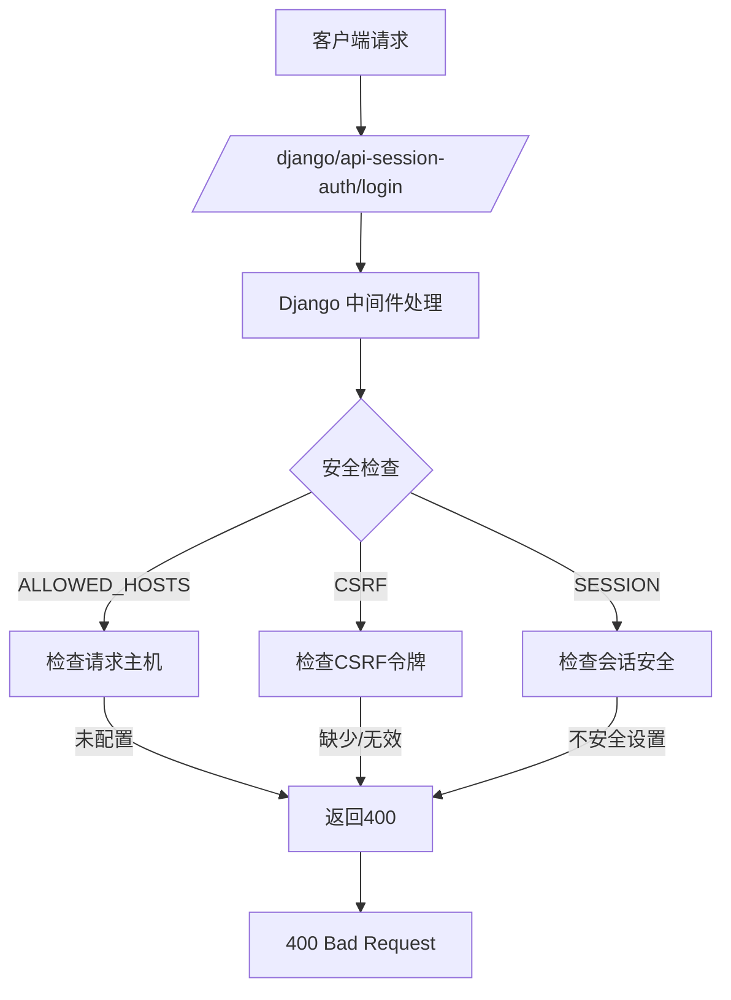
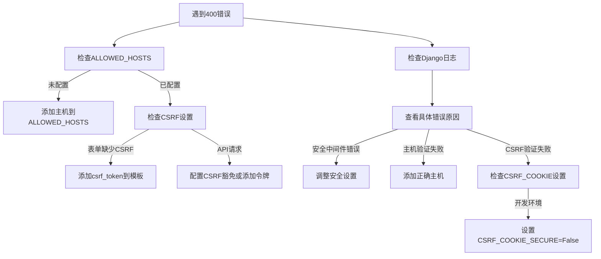

# Django DEBUG=False 导致 400 Bad Request 错误分析

当您将 Django 的 `DEBUG = False` 后访问登录页面出现 400 Bad Request 错误时，这通常是由于 Django 的安全机制在非调试模式下被激活导致的。以下是详细分析和解决方案：

## 问题原因分析



关键问题点：
1. **ALLOWED_HOSTS 未配置**：当 DEBUG=False 时，Django 要求必须配置 ALLOWED_HOSTS
2. **CSRF 保护机制**：登录表单需要 CSRF 令牌验证
3. **安全中间件**：Django 的安全中间件在非调试模式下更严格
4. **Cookie 安全设置**：SESSION_COOKIE_SECURE 和 CSRF_COOKIE_SECURE 设置不正确

## 解决方案

### 1. 配置 ALLOWED_HOSTS (最紧急)

在 Django 的 settings.py 中添加：

```python
# 允许本地开发
ALLOWED_HOSTS = ['localhost', '127.0.0.1']

# 或者允许所有主机（仅限开发环境）
# ALLOWED_HOSTS = ['*']  # 生产环境不要使用
```

### 2. 处理 CSRF 保护

#### 对于模板视图（传统 Django 表单）

确保登录表单中包含 CSRF 令牌：
```html
<form method="post">
  
  <!-- 其他表单字段 -->
  <input type="submit" value="登录">
</form>
```

#### 对于 API 视图（DRF）

配置 DRF 的认证设置：

```python
# settings.py
REST_FRAMEWORK = {
    'DEFAULT_AUTHENTICATION_CLASSES': [
        'rest_framework.authentication.SessionAuthentication',
    ]
}

# 添加 CSRF 豁免（如果需要）
from django.views.decorators.csrf import csrf_exempt
from rest_framework.decorators import api_view

@api_view(['POST'])
@csrf_exempt
def login_view(request):
    # 登录逻辑
```

### 3. 调整安全设置（开发环境）

在 settings.py 中添加以下开发环境专用的安全设置：

```python
# 禁用安全中间件（仅限开发）
# MIDDLEWARE.remove('django.middleware.security.SecurityMiddleware')

# 调整安全设置
SESSION_COOKIE_SECURE = False  # 开发环境使用 HTTP
CSRF_COOKIE_SECURE = False     # 开发环境使用 HTTP
SECURE_SSL_REDIRECT = False    # 禁用 HTTPS 重定向

# 配置 CSRF 信任来源
CSRF_TRUSTED_ORIGINS = [
    'http://localhost:8000',
    'http://127.0.0.1:8000'
]

# 允许跨域请求（如果前端分离）
CORS_ALLOWED_ORIGINS = [
    "http://localhost:3000",
    "http://127.0.0.1:3000",
]
```

### 4. 完整的安全配置示例

```python
# settings.py

# 基本配置
DEBUG = False
ALLOWED_HOSTS = ['localhost', '127.0.0.1', 'yourdomain.com']

# 安全配置
SECRET_KEY = 'your-secret-key'  # 确保使用强密钥

# 会话和CSRF配置
SESSION_COOKIE_HTTPONLY = True
CSRF_COOKIE_HTTPONLY = True  # 如果使用JavaScript访问CSRF令牌，设为False

# 生产环境应设置为True（需要HTTPS）
SESSION_COOKIE_SECURE = False  # 开发环境设为False
CSRF_COOKIE_SECURE = False     # 开发环境设为False

# 信任的来源
CSRF_TRUSTED_ORIGINS = [
    'http://localhost:8000',
    'http://127.0.0.1:8000',
    'https://yourdomain.com'
]

# 安全中间件
MIDDLEWARE = [
    # ...
    'django.middleware.security.SecurityMiddleware',
    'django.middleware.csrf.CsrfViewMiddleware',
    # ...
]
```

### 5. 检查 Django 日志

在 settings.py 中配置日志记录以获取更详细的错误信息：

```python
LOGGING = {
    'version': 1,
    'disable_existing_loggers': False,
    'handlers': {
        'console': {
            'class': 'logging.StreamHandler',
        },
    },
    'root': {
        'handlers': ['console'],
        'level': 'DEBUG' if DEBUG else 'INFO',
    },
    'loggers': {
        'django': {
            'handlers': ['console'],
            'level': 'DEBUG' if DEBUG else 'INFO',
            'propagate': True,
        },
        'django.security': {
            'handlers': ['console'],
            'level': 'DEBUG',
            'propagate': True,
        },
    },
}
```

### 6. 诊断视图

创建一个诊断视图来检查当前安全设置：

```python
# urls.py
from django.http import JsonResponse
from django.conf import settings

def security_settings(request):
    """返回当前安全设置状态"""
    return JsonResponse({
        'ALLOWED_HOSTS': settings.ALLOWED_HOSTS,
        'CSRF_COOKIE_SECURE': settings.CSRF_COOKIE_SECURE,
        'SESSION_COOKIE_SECURE': settings.SESSION_COOKIE_SECURE,
        'SECURE_SSL_REDIRECT': settings.SECURE_SSL_REDIRECT,
        'CSRF_TRUSTED_ORIGINS': settings.CSRF_TRUSTED_ORIGINS,
        'request_host': request.get_host(),
        'is_secure': request.is_secure(),
    })
```

## 生产环境最佳实践

当部署到生产环境时，应该使用以下安全配置：

```python
# 生产环境安全设置
DEBUG = False

# 必须配置实际域名
ALLOWED_HOSTS = ['yourdomain.com', 'www.yourdomain.com']

# 启用HTTPS相关设置
SESSION_COOKIE_SECURE = True
CSRF_COOKIE_SECURE = True
SECURE_SSL_REDIRECT = True
SECURE_HSTS_SECONDS = 31536000  # 1年
SECURE_HSTS_INCLUDE_SUBDOMAINS = True
SECURE_HSTS_PRELOAD = True
SECURE_CONTENT_TYPE_NOSNIFF = True
SECURE_BROWSER_XSS_FILTER = True
X_FRAME_OPTIONS = 'DENY'

# 配置代理相关设置
USE_X_FORWARDED_HOST = True
SECURE_PROXY_SSL_HEADER = ('HTTP_X_FORWARDED_PROTO', 'https')
```

## 错误排查流程



## 常见错误场景及解决方案

| 错误场景 | 表现 | 解决方案 |
|---------|------|---------|
| ALLOWED_HOSTS未配置 | 日志中出现"SuspiciousOperation" | 添加请求主机到ALLOWED_HOSTS |
| 缺少CSRF令牌 | 表单提交时400错误 | 在表单中添加 |
| HTTPS配置问题 | 生产环境无法登录 | 设置SESSION_COOKIE_SECURE=True并启用HTTPS |
| 跨域请求 | 前端分离架构登录失败 | 配置CORS和CSRF_TRUSTED_ORIGINS |
| 代理配置错误 | 获取不到正确的主机名 | 设置USE_X_FORWARDED_HOST和SECURE_PROXY_SSL_HEADER |

通过以上配置和排查步骤，您应该能够解决 DEBUG=False 导致的 400 Bad Request 错误。核心解决方案是正确配置 ALLOWED_HOSTS 和调整安全设置以适应开发环境。生产环境部署时，请务必遵循安全最佳实践。
