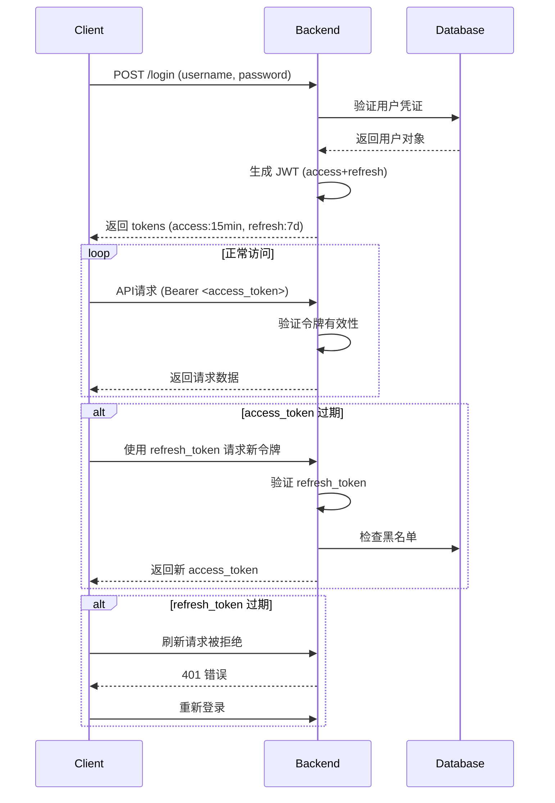

在 Django 和 DRF 中设置登录过期时间需要根据使用的认证方式分别配置。以下是不同认证方式下的详细设置方法：

---

### 一、Django 自带认证系统（Session 认证）的过期时间设置

Django 的 admin 和普通视图使用 Session 认证，过期时间通过以下设置控制：

```python
# settings.py

# 1. 设置 Session 过期时间（默认 2 周）
SESSION_COOKIE_AGE = 1209600  # 秒（14 天）

# 2. 浏览器关闭时 Session 过期（默认为 False）
SESSION_EXPIRE_AT_BROWSER_CLOSE = False

# 3. 每次请求更新 Session 过期时间（默认为 False）
SESSION_SAVE_EVERY_REQUEST = True  # 每次请求都延长过期时间

# 4. 自定义 Session 引擎（可选）
SESSION_ENGINE = "django.contrib.sessions.backends.cached_db"  # 缓存+数据库
```

#### 高级设置：自定义过期时间逻辑

```python
# middleware.py
from datetime import timedelta
from django.utils import timezone
from django.contrib.sessions.middleware import SessionMiddleware

class CustomSessionMiddleware(SessionMiddleware):
    def process_request(self, request):
        super().process_request(request)
        # 设置自定义过期时间（例如：30分钟）
        request.session.set_expiry(1800)  # 30 * 60 秒
```

在视图中动态设置过期时间：
```python
def login_view(request):
    if request.method == "POST":
        # 验证用户...
        request.session.set_expiry(1800)  # 30分钟后过期
        return redirect("/dashboard/")
```

---

### 二、DRF Token 认证的过期时间设置

DRF 的默认 Token 认证是**永不过期**的，需要自定义实现过期功能：

#### 步骤 1：创建自定义 Token 模型
```python
# models.py
from django.conf import settings
from django.db import models
from django.utils import timezone
from rest_framework.authtoken.models import Token as DefaultTokenModel

class ExpiringToken(DefaultTokenModel):
    expires_at = models.DateTimeField()

    @classmethod
    def create_token(cls, user):
        token, created = cls.objects.get_or_create(user=user)
        token.expires_at = timezone.now() + timezone.timedelta(hours=1)  # 1小时后过期
        token.save()
        return token

    @property
    def is_expired(self):
        return timezone.now() >= self.expires_at
```

#### 步骤 2：创建自定义认证类
```python
# authentication.py
from rest_framework.authentication import TokenAuthentication
from rest_framework import exceptions
from .models import ExpiringToken

class ExpiringTokenAuthentication(TokenAuthentication):
    model = ExpiringToken

    def authenticate_credentials(self, key):
        try:
            token = self.model.objects.get(key=key)
        except self.model.DoesNotExist:
            raise exceptions.AuthenticationFailed("Invalid token")

        if token.is_expired:
            token.delete()  # 删除过期 token
            raise exceptions.AuthenticationFailed("Token has expired")

        return (token.user, token)
```

#### 步骤 3：配置 settings.py
```python
# settings.py
REST_FRAMEWORK = {
    'DEFAULT_AUTHENTICATION_CLASSES': [
        'myapp.authentication.ExpiringTokenAuthentication',  # 使用自定义认证
    ],
    'DEFAULT_PERMISSION_CLASSES': [
        'rest_framework.permissions.IsAuthenticated',
    ]
}
```

#### 步骤 4：自定义 Token 获取视图
```python
# views.py
from rest_framework.views import APIView
from rest_framework.response import Response
from rest_framework import status
from .models import ExpiringToken

class CustomAuthToken(APIView):
    def post(self, request):
        # 验证用户名密码...
        user = authenticate(username=..., password=...)
        if user:
            token = ExpiringToken.create_token(user)
            return Response({'token': token.key})
        return Response(status=status.HTTP_401_UNAUTHORIZED)
```

---

### 三、JWT 认证的过期时间设置（推荐）

使用 `djangorestframework-simplejwt` 库可以轻松设置 JWT 过期时间：

#### 安装：
```bash
pip install djangorestframework-simplejwt
```

#### 配置 settings.py：
```python
# settings.py
from datetime import timedelta

REST_FRAMEWORK = {
    'DEFAULT_AUTHENTICATION_CLASSES': [
        'rest_framework_simplejwt.authentication.JWTAuthentication',
    ]
}

SIMPLE_JWT = {
    # 访问令牌过期时间
    'ACCESS_TOKEN_LIFETIME': timedelta(minutes=15),
    
    # 刷新令牌过期时间（用于获取新访问令牌）
    'REFRESH_TOKEN_LIFETIME': timedelta(days=7),
    
    # 是否允许刷新过期令牌
    'ROTATE_REFRESH_TOKENS': True,
    
    # 刷新后是否保留旧刷新令牌
    'BLACKLIST_AFTER_ROTATION': True,
    
    # 更新用户最后登录时间
    'UPDATE_LAST_LOGIN': True,
    
    # 自定义过期响应
    'TOKEN_OBTAIN_SERIALIZER': 'myapp.serializers.CustomTokenObtainPairSerializer',
}
```

#### 自定义令牌响应（可选）：
```python
# serializers.py
from rest_framework_simplejwt.serializers import TokenObtainPairSerializer

class CustomTokenObtainPairSerializer(TokenObtainPairSerializer):
    @classmethod
    def get_token(cls, user):
        token = super().get_token(user)
        
        # 添加自定义声明
        token['name'] = user.get_full_name()
        token['exp'] = int((timezone.now() + timedelta(hours=2)).timestamp())  # 自定义过期
        
        return token

    def validate(self, attrs):
        data = super().validate(attrs)
        
        # 添加自定义响应数据
        data['user_id'] = self.user.id
        data['expires_in'] = self.access_token.payload['exp']  # 返回过期时间
        
        return data
```

---

### 四、不同场景的最佳实践

| 场景                     | 推荐方式          | 过期时间设置建议         |
|--------------------------|-------------------|--------------------------|
| Django Admin             | Session 认证      | 30-60 分钟               |
| 传统 Web 应用            | Session 认证      | 用户活动时延长（滑动过期）|
| 移动端/前后端分离        | JWT               | Access Token: 15-30 分钟 |
|                          |                   | Refresh Token: 7-30 天   |
| 服务间通信               | Token 认证        | 长期有效（定期轮换）     |
| 高安全要求系统           | Session + 2FA     | 15-30 分钟 + 重新认证    |

---

### 五、安全增强建议

1. **HTTPS 必须**：所有认证信息通过 HTTPS 传输
2. **安全 Cookie 设置**：
   ```python
   SESSION_COOKIE_SECURE = True     # 仅 HTTPS
   SESSION_COOKIE_HTTPONLY = True   # 防止 JS 访问
   SESSION_COOKIE_SAMESITE = 'Lax'  # CSRF 防护
   ```
3. **JWT 安全设置**：
   ```python
   SIMPLE_JWT = {
       'AUTH_HEADER_TYPES': ('Bearer',),
       'AUTH_TOKEN_CLASSES': ('rest_framework_simplejwt.tokens.AccessToken',),
       'SIGNING_KEY': SECRET_KEY,  # 使用强密钥
   }
   ```
4. **定期轮换密钥**：特别是 JWT 签名密钥
5. **令牌黑名单**：实现注销功能
   ```python
   # 安装 django-rest-framework-simplejwt 的 blacklist 应用
   INSTALLED_APPS += ('rest_framework_simplejwt.token_blacklist',)
   ```

---

### 六、完整登录流程示例（JWT）



通过以上配置，你可以为 Django 和 DRF 系统设置灵活的登录过期策略，平衡用户体验与系统安全性。对于现代应用，推荐使用 JWT 方案；对于传统 Web 应用，Session 认证配合适当的过期时间是最佳选择。