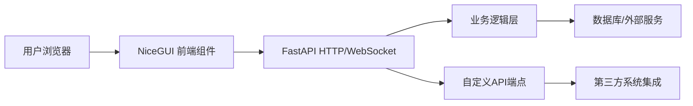

NiceGUI 中的 FastAPI 扮演着至关重要的角色，它不仅是底层引擎，还提供了强大的扩展能力。以下是 FastAPI 在 NiceGUI 项目中的核心作用和价值：

---

### 1. **底层 HTTP/WebSocket 服务器**
NiceGUI 本身不处理网络通信，而是**完全依赖 FastAPI** 作为其底层服务器：
- 处理所有 HTTP 请求（页面加载、API调用）
- 管理 WebSocket 连接（实现实时UI更新）
- 提供 ASGI 兼容的服务器接口

```python
from nicegui import ui
ui.run()  # 实际上启动了 FastAPI 服务器
```

---

### 2. **API 路由扩展**
可以直接在 NiceGUI 应用中添加 FastAPI 路由，**扩展后端功能**：
```python
from fastapi import APIRouter

# 创建独立的 API 路由
api_router = APIRouter()

@api_router.get("/data")
def get_data():
    return {"data": [1, 2, 3]}

# 将路由挂载到 NiceGUI 应用
ui.add_api_router(api_router)
```

---

### 3. **中间件集成**
利用 FastAPI 中间件实现**高级控制**：
```python
from fastapi.middleware.cors import CORSMiddleware

app = ui.native.app  # 获取底层 FastAPI 实例

app.add_middleware(
    CORSMiddleware,
    allow_origins=["*"],
    allow_methods=["*"]
)
```

---

### 4. **依赖注入系统**
使用 FastAPI 的依赖注入管理**资源和服务**：
```python
from fastapi import Depends

def get_db():
    # 数据库连接逻辑
    return db_session

@ui.page("/admin")
def admin_page(db: Session = Depends(get_db)):
    data = db.query(User).all()
    ui.table(data)
```

---

### 5. **后台任务处理**
结合 FastAPI 的**后台任务**执行长时间操作：
```python
from fastapi import BackgroundTasks

def process_data(data: str):
    # 耗时处理
    ...

@ui.page("/upload")
async def upload_page(background_tasks: BackgroundTasks):
    async def on_upload(e):
        background_tasks.add_task(process_data, e.content)
        ui.notify("处理中...")
    
    ui.upload(on_upload=on_upload)
```

---

### 6. **认证与授权**
实现完整的**安全体系**：
```python
from fastapi.security import OAuth2PasswordBearer

oauth2_scheme = OAuth2PasswordBearer(tokenUrl="token")

def get_current_user(token: str = Depends(oauth2_scheme)):
    # 验证逻辑
    return user

@ui.page("/profile")
def profile(user: User = Depends(get_current_user)):
    ui.label(f"欢迎, {user.name}")
```

---

### 7. **OpenAPI 集成**
**自动生成 API 文档**：
```python
# 添加自定义 OpenAPI 文档
app = ui.native.app
app.openapi_tags = [{"name": "数据分析", "description": "数据处理接口"}]

@api_router.get("/stats", tags=["数据分析"])
def get_stats():
    return {"metric": 42}
```
访问 `/docs` 查看完整 API 文档

---

### 8. **WebSocket 高级控制**
直接操作 WebSocket 实现**实时通信**：
```python
from nicegui import app

@app.websocket("/custom_ws")
async def custom_websocket(websocket: WebSocket):
    await websocket.accept()
    while True:
        data = await websocket.receive_text()
        # 处理数据...
        await websocket.send_text(f"收到: {data}")
```

---

### 9. **静态文件服务**
托管**静态资源**：
```python
from fastapi.staticfiles import StaticFiles

app.mount("/static", StaticFiles(directory="static"), name="static")
```

---

### 10. **与现有 FastAPI 项目集成**
将 NiceGUI 作为**子模块**嵌入现有项目：
```python
from fastapi import FastAPI
from nicegui import ui

main_app = FastAPI()

@ui.page("/app")
def main_interface():
    ui.label("NiceGUI 界面")

main_app.mount("/ui", ui.app)  # 挂载到 /ui 路径

# 原有 API 保持不变
@main_app.get("/api/data")
def api_data():
    return {"key": "value"}
```

---

### 实际应用场景
1. **仪表盘后台**：用 NiceGUI 构建 UI + FastAPI 提供数据 API
2. **物联网控制台**：WebSocket 实时数据 + NiceGUI 可视化
3. **机器学习部署**：NiceGUI 前端交互 + FastAPI 模型推理 API
4. **内部工具**：快速开发带认证的业务工具

---

### 关键优势
| 特性 | NiceGUI | FastAPI | 组合价值 |
|------|---------|---------|----------|
| UI开发速度 | ⭐⭐⭐⭐⭐ | ❌ | 快速构建美观界面 |
| API能力 | 基础 | ⭐⭐⭐⭐⭐ | 完整后端服务 |
| 实时通信 | WebSocket支持 | WebSocket支持 | 无缝双向通信 |
| 部署 | 单文件 | 生产级 | 开箱即用生产部署 |

---

### 推荐架构模式


**总结**：NiceGUI 中的 FastAPI 不是简单的依赖项，而是赋予 NiceGUI **完整后端能力**的核心引擎。它使 NiceGUI 从纯前端框架升级为全栈解决方案，特别适合需要复杂后端逻辑的交互式应用。
