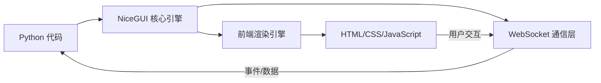
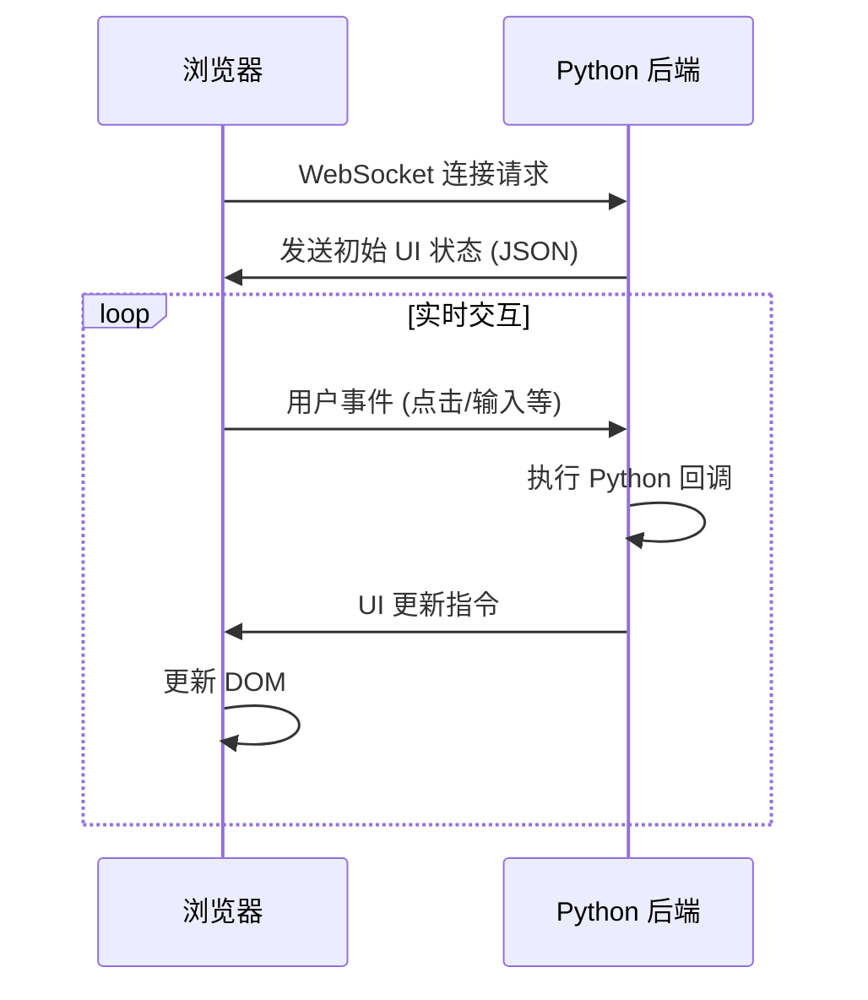
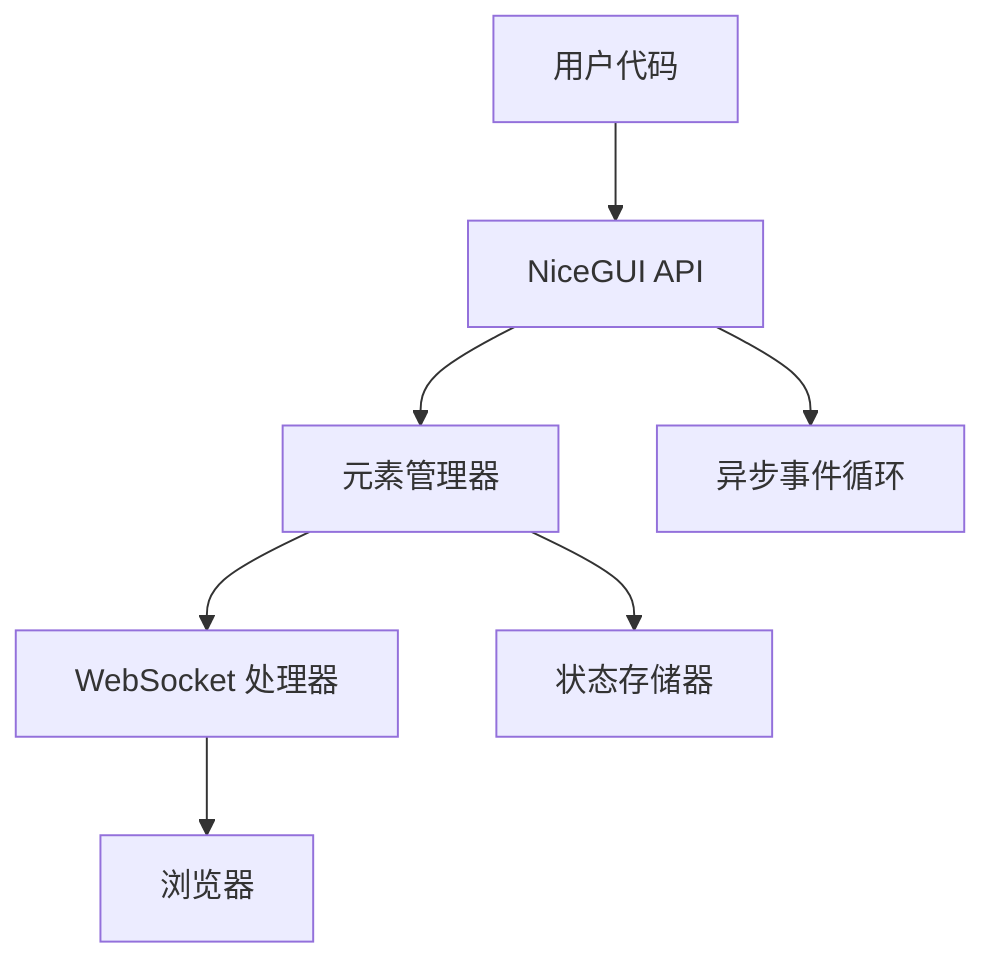
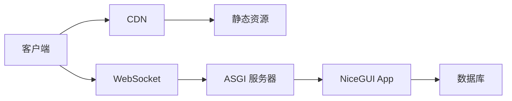

NiceGUI 是一个基于 Python 的高级 Web UI 框架，其核心原理是通过抽象层将 Python 对象和操作转换为现代 Web 技术（HTML/CSS/JavaScript），并建立实时双向通信机制。以下是其工作原理的深度解析：

### 核心原理架构


### 1. Python 到前端的转换机制

#### a) 声明式 UI 构建
```python
from nicegui import ui

# Python 对象
button = ui.button('点击我', on_click=lambda: ui.notify('已点击!'))
slider = ui.slider(min=0, max=100, value=50)

# 会被转换为：
# <button class="nicegui-button">点击我</button>
# <input type="range" min="0" max="100" value="50">
```

#### b) 响应式数据绑定
```python
value = ui.bind(lambda: slider.value)  # 创建响应式绑定

# 当滑块值改变时，自动更新文本
ui.label().bind_text_from(value, backward=lambda v: f'当前值: {v}')
```
**转换过程**：
1. 创建 `MutationObserver` 监听 DOM 变化
2. 通过 WebSocket 发送变化值到后端
3. Python 更新绑定变量
4. 计算新值并通过 WebSocket 推送更新

### 2. 通信层实现

#### WebSocket 协议工作流：


#### 消息格式示例：
```json
// 事件消息
{
  "type": "event",
  "element_id": "btn-123",
  "event": "click",
  "data": null
}

// 更新消息
{
  "type": "update",
  "element_id": "label-456",
  "property": "text",
  "value": "新文本"
}
```

### 3. 前端渲染引擎

NiceGUI 使用现代前端技术栈：
- **Vue.js**：核心 UI 响应式引擎
- **Tailwind CSS**：样式系统
- **Quasar**：组件库基础
- **WebSocket API**：实时通信

**渲染流程**：
1. 接收初始 UI 描述 (JSON)
2. 动态创建 Vue 组件树
3. 建立数据绑定和事件监听
4. 响应后端更新指令

### 4. Python 运行时环境



关键组件：
- **元素树管理**：维护所有 UI 组件的层次结构
- **事件调度器**：将前端事件映射到 Python 回调
- **虚拟DOM 差异引擎**：计算最小更新集
- **资源打包器**：自动打包 CSS/JS 资源

### 5. 与其他框架的对比

| 特性 | NiceGUI | Streamlit | Dash | PyWebIO |
|------|---------|----------|------|---------|
| **通信方式** | WebSocket | HTTP 轮询 | WebSocket | HTTP |
| **响应式能力** | 实时双向 | 单向 | 双向 | 单向 |
| **组件模型** | 面向对象 | 脚本顺序 | 声明式 | 命令式 |
| **状态管理** | 自动同步 | 会话状态 | 显式回调 | 无状态 |
| **学习曲线** | 平缓 | 简单 | 陡峭 | 简单 |

### 6. 高级特性实现原理

#### a) 自动路由
```python
@ui.page('/dashboard')
def dashboard():
    ui.label('控制面板')
```
- 动态创建 FastAPI 路由
- 为每个页面生成独立的状态隔离
- 使用 Vue Router 实现前端导航

#### b) 数据可视化
```python
ui.chart({
    'xAxis': {'type': 'category'},
    'series': [{'data': [10, 20, 30]}]
})
```
- 封装 ECharts 库
- 通过 JSON 序列化配置
- 建立 Python 数据到 JS 的数据管道

#### c) 异步支持
```python
async def load_data():
    data = await fetch_from_db()
    ui.notify(f'加载了 {len(data)} 条记录')

ui.button('加载', on_click=load_data)
```
- 集成 asyncio 事件循环
- 使用 WebSocket 的异步消息处理
- 协程安全的状态更新

### 7. 性能优化策略

1. **增量更新**：
   - 仅发送变化的 UI 部分
   - 虚拟 DOM diff 算法
   
2. **批量处理**：
   ```python
   with ui.card().classes('p-4'):  # 单次更新
       ui.label('项目1')
       ui.label('项目2')
   ```

3. **客户端计算**：
   ```python
   # 在前端执行计算
   ui.number('输入').bind_value_to(
       slider, 'value', 
       transform=lambda v: v * 2  # JS 中执行
   )
   ```

4. **资源缓存**：
   - 自动版本控制静态资源
   - 长期缓存哈希命名的文件

### 8. 部署架构

**生产环境部署**：


关键组件：
- **ASGI 服务器**：Uvicorn/Hypercorn
- **反向代理**：Nginx/Traefik (处理 WebSocket 升级)
- **会话管理**：Redis 存储状态

### 9. 安全机制

1. **通信安全**：
   - 强制 WSS (WebSocket Secure)
   - 消息签名验证

2. **注入防护**：
   ```python
   # 自动转义内容
   ui.html('<script>alert(1)</script>') 
   # 输出: &lt;script&gt;alert(1)&lt;/script&gt;
   ```

3. **CORS 防护**：
   - 默认禁止跨域
   - 严格的内容安全策略

### 优势与限制

**优势**：
- 极简 API：10 行代码创建交互式应用
- 实时交互：毫秒级响应
- 零前端知识：纯 Python 开发
- 丰富组件：100+ 内置组件

**限制**：
- 复杂动画支持有限
- 超大规模应用需要优化
- SEO 不友好（SPA 特性）

### 总结

NiceGUI 的本质是一个**实时双向绑定编译器**，它：
1. 将 Python UI 对象编译为虚拟 DOM
2. 通过 WebSocket 建立双向通信通道
3. 使用 Vue.js 实现动态渲染
4. 桥接 Python 逻辑与浏览器环境

这种架构使开发者能用纯 Python 创建现代 Web 应用，特别适合：
- 数据仪表盘
- IoT 控制面板
- 内部工具开发
- 快速原型验证

通过抽象底层 Web 技术细节，NiceGUI 实现了 "Python as a Single Source of Truth" 的理念，极大提升了开发效率。