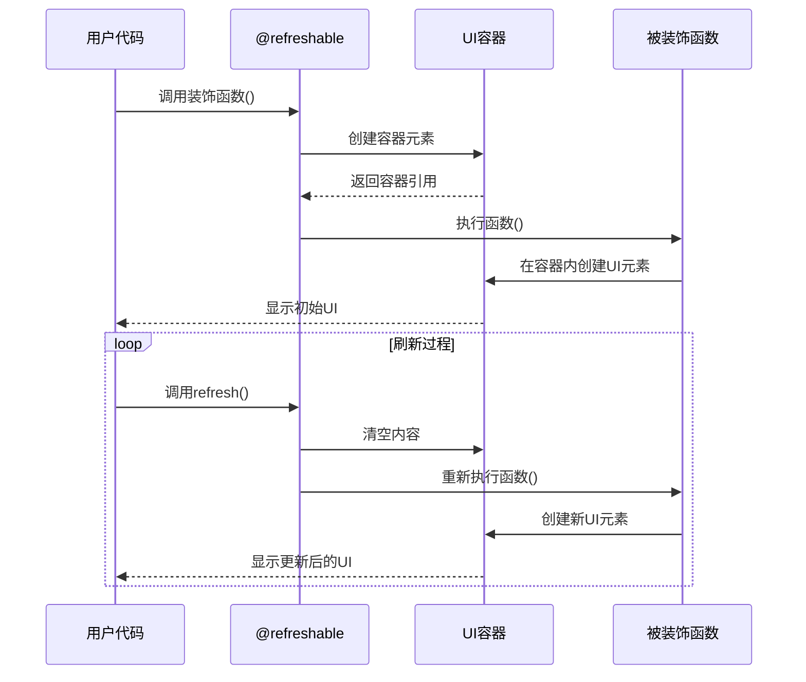

# NiceGUI 的 `@ui.refreshable` 实现原理分析

NiceGUI 是一个用于构建 Web UI 的 Python 框架，`@ui.refreshable` 是其核心功能之一，用于创建可动态刷新的 UI 组件。下面我将详细解析其实现原理：

## 核心实现原理

### 1. 装饰器架构
`@ui.refreshable` 本质上是一个**高阶函数装饰器**，它包装了用户定义的 UI 生成函数，并添加了刷新能力：

```python
def refreshable(func):
    class RefreshableFunction:
        def __init__(self, func):
            self.func = func
            self.container = None  # 存储当前UI组件的容器
            self.parent_context = None  # 父级UI上下文
            
        def __call__(self, *args, **kwargs):
            # 首次调用时创建UI
            if self.container is None:
                # 获取当前UI上下文
                self.parent_context = ui.context.get_current()
                # 创建容器元素
                self.container = ui.element('div')
                
            # 在容器内创建/刷新UI
            with self.container:
                ui.context.set_current(self.parent_context)
                return self.func(*args, **kwargs)
                
        def refresh(self):
            """触发UI刷新"""
            # 清空容器内容
            self.container.clear()
            # 重新调用函数生成新UI
            self.__call__()
            
    return RefreshableFunction(func)
```

### 2. 刷新机制工作流程



## 关键设计要点

### 1. 容器隔离
- 每个 `@refreshable` 函数对应一个**独立容器**（通常是 `<div>` 元素）
- 刷新时只操作该容器内的内容，不影响外部UI
- 容器作为状态存储，保存对当前UI的引用

### 2. 上下文管理
```python
with self.container:
    ui.context.set_current(self.parent_context)
    return self.func(*args, **kwargs)
```
- 使用 `with` 语句确保UI创建在正确上下文中
- 保存父级上下文保证UI层级关系正确
- 确保事件绑定等操作关联到正确元素

### 3. 状态保留与重置
- **状态保留**：函数外部变量保持不变
- **UI重置**：每次刷新完全重建组件树
- **智能优化**：NiceGUI内部使用虚拟DOM减少实际DOM操作

### 4. 刷新触发机制
```python
# 用户调用方式
@ui.refreshable
def my_content():
    ...

# 刷新操作
my_content.refresh()
```
- 动态添加 `refresh()` 方法到函数对象
- 实际实现中会使用 `WeakRef` 防止内存泄漏
- 支持链式调用和异步刷新

## 实际应用场景

### 动态数据展示
```python
counter = 0

@ui.refreshable
def counter_display():
    ui.label(f'Count: {counter}')
    # 复杂UI结构
    with ui.row():
        ui.button('A')
        ui.button('B')

def increment():
    global counter
    counter += 1
    counter_display.refresh()  # 仅刷新显示组件
```

### 条件渲染
```python
@ui.refreshable
def adaptive_content():
    if user.role == 'admin':
        show_admin_panel()
    else:
        show_user_view()

# 权限变更时刷新
user.update_role('admin')
adaptive_content.refresh()
```

### 表单重置
```python
@ui.refreshable
def data_entry_form():
    with ui.column():
        ui.input('Name')
        ui.input('Email')
        ui.button('Submit', on_click=submit)

def submit():
    # 处理数据...
    data_entry_form.refresh()  # 重置表单
```

## 性能优化策略

NiceGUI 在刷新时采用了多种优化技术：

1. **虚拟DOM比较**：比较前后组件树差异，只更新变化部分
   ```python
   # 伪代码实现
   def refresh(self):
       old_tree = self.virtual_dom
       self.container.clear()
       new_tree = self._render()
       diff = compare_dom(old_tree, new_tree)
       apply_diff(self.container, diff)
   ```

2. **批量更新**：多个刷新请求合并为单次DOM操作
   ```python
   # 事件循环中的处理
   def process_updates():
       while not update_queue.empty():
           batch = collect_updates()
           with bulk_update():
               for update in batch:
                   execute_update(update)
   ```

3. **智能清理**：自动解绑旧事件监听器，防止内存泄漏
   ```python
   class Element:
       def clear(self):
           for handler in self.event_handlers:
               js_api.remove_event_listener(self.id, handler)
           super().clear()
   ```

4. **部分刷新**：支持嵌套刷新控制
   ```python
   @ui.refreshable
   def parent():
       ui.label('Header')
       child_component()  # 独立刷新区域
       ui.label('Footer')
   
   @ui.refreshable
   def child_component():
       ...  # 可单独刷新
   ```

## 与传统前端框架对比

| 特性               | NiceGUI @refreshable | React Hooks       | Vue Composition API |
|--------------------|----------------------|-------------------|---------------------|
| 更新粒度           | 组件级               | 组件级            | 组件级              |
| 状态管理           | Python变量          | useState()        | ref()/reactive()   |
| DOM操作            | 全自动               | 虚拟DOM           | 虚拟DOM             |
| 学习曲线           | 极低 (纯Python)      | 中等              | 中等                |
| 性能优化           | 自动批处理           | 手动优化          | 自动追踪依赖        |
| 适用场景           | 后台/工具类应用      | 大型前端应用      | 大型前端应用        |

## 实现原理总结

1. **容器隔离**：每个可刷新组件拥有独立的DOM容器
2. **函数包装**：通过装饰器添加刷新能力
3. **上下文保存**：维护UI层级关系
4. **重建而非更新**：每次刷新完全重建组件树
5. **自动优化**：虚拟DOM差异更新和批量处理
6. **Pythonic API**：简洁的 `.refresh()` 方法调用

`@ui.refreshable` 的设计体现了 NiceGUI 的核心哲学：**用最简单的Python语法实现动态Web UI**。它通过巧妙的封装，让开发者无需关心DOM操作细节，只需关注业务逻辑实现，同时保持足够的灵活性应对各种交互场景。