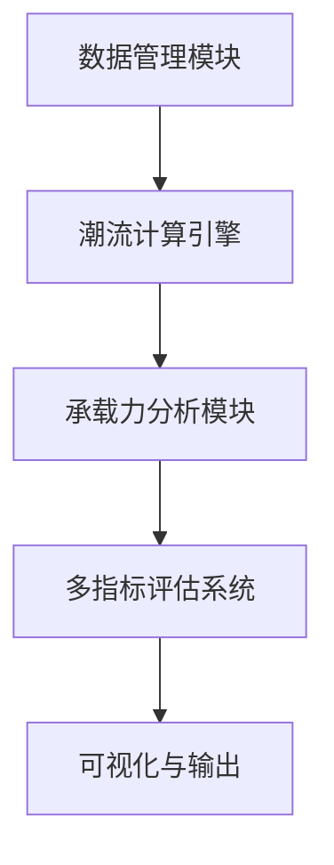

## 项目可行性及难度分析

### 一、项目核心模块分解



### 二、可行性分析

#### 1. 技术可行性（高）
- **数据处理**：Python生态（Pandas, NumPy）可完美处理数据解析、归一化和一致性检查
- **潮流计算**：成熟解决方案（Pandapower, PYPOWER）支持配电网计算
- **承载力计算**：蒙特卡洛方法有现成框架（SciPy, NumPy）
- **综合评估**：AHP/CRITIC有成熟数学库（PyDecision, SciPy）
- **可视化**：Plotly/Dash/Bokeh可满足所有可视化需求

#### 2. 算法可行性（中高）
- 所有核心算法均有公开文献和标准实现
- 光伏承载力计算有IEEE标准方法参考
- 多指标评估体系在电力系统有成熟应用案例

#### 3. 资源可行性（中）
- 需要电力系统专业背景开发人员
- 需要中高性能计算资源（蒙特卡洛模拟）
- 开发周期：6-9个月（含测试验证）

### 三、技术难度分析

#### 1. 数据管理模块（难度：★★☆）
- **挑战**：
  - 多采样周期数据对齐（15min/1h）
  - 拓扑结构动态解析（需处理环网/辐射网）
  - 数据一致性检查规则库建设
- **解决方案**：
  ```python
  class DataNormalizer:
      def __init__(self, topology):
          self.topology = topology
          self.data_frames = []
          
      def add_dataset(self, file_path, sample_rate):
          # 解析不同格式数据文件
          df = self._parse_file(file_path)
          # 时间序列对齐
          df = self._resample(df, sample_rate)
          # 拓扑一致性验证
          self._validate_topology(df)
          self.data_frames.append(df)
          
      def _resample(self, df, target_rate):
          # 实现智能降采样/插值
          if df.sample_rate != target_rate:
              # 使用电力系统专用插值法
              return power_system_resample(df, target_rate)
          return df
```

#### 2. 潮流计算引擎（难度：★★★☆）
- **挑战**：
  - 大规模时序潮流计算效率
  - 收敛性问题处理（特别是高光伏渗透率场景）
  - 分布式电源精确建模
- **关键技术点**：
  ```python
  class TimeSeriesPowerFlow:
      def __init__(self, network_model):
          self.network = network_model
          self.solver = pandapowerNewtonSolver()
          
      def run_timeseries(self, scenarios):
          results = []
          for ts, load_data in scenarios:
              # 节点注入功率更新
              self._update_loads(load_data)
              # 并行计算优化
              with ThreadPoolExecutor() as executor:
                  future = executor.submit(self.solver.solve, self.network)
                  try:
                      result = future.result(timeout=30)
                  except ConvergenceError:
                      result = self._handle_divergence()
                  results.append(result)
          return PowerFlowResults(results)
```

#### 3. 光伏承载力分析（难度：★★★★）
- **挑战**：
  - 蒙特卡洛场景生成与缩减
  - 动态承载力曲线计算
  - 区域准入容量优化
- **核心算法**：
  ```python
  class PVHostingCapacity:
      def monte_carlo_analysis(self, scenarios=1000):
          capacity_results = []
          for _ in range(scenarios):
              # 随机光伏/负荷场景生成
              scenario = self._generate_scenario()
              # 连续潮流计算
              max_capacity = self._find_max_pv(scenario)
              capacity_results.append(max_capacity)
          
          # 概率分析
          return self._probability_analysis(capacity_results)
      
      def _find_max_pv(self, scenario):
          # 二分搜索法寻找最大准入容量
          low, high = 0, MAX_CAPACITY
          while high - low > PRECISION:
              mid = (low + high) / 2
              if self._check_violations(scenario, mid):
                  high = mid
              else:
                  low = mid
          return low
```

#### 4. 多指标综合评估（难度：★★★☆）
- **挑战**：
  - 多维度指标体系构建
  - AHP/CRITIC权重融合
  - 判断矩阵一致性修正
- **实现方案**：
  ```python
  class ComprehensiveEvaluator:
      def __init__(self):
          self.metrics = {
              'safety': SafetyMetrics(),
              'reliability': ReliabilityMetrics(),
              'economy': EconomicMetrics(),
              'environment': EnvironmentalMetrics()
          }
          
      def evaluate(self, powerflow_results):
          scores = {}
          for dim, calculator in self.metrics.items():
              scores[dim] = calculator.compute(powerflow_results)
          
          # AHP权重计算（主观权重）
          ahp_weights = self._compute_ahp_weights()
          # CRITIC权重计算（客观权重）
          critic_weights = self._compute_critic_weights(scores)
          # 组合权重
          combined_weights = self._fuse_weights(ahp_weights, critic_weights)
          
          # 综合评分
          return np.dot(list(scores.values()), combined_weights)
      
      def _compute_ahp_weights(self):
          # 实现一致性检验和矩阵修正
          matrix = self._get_judgement_matrix()
          while not self._check_consistency(matrix):
              matrix = self._adjust_matrix(matrix)
          return self._eigenvector_method(matrix)
```

#### 5. 可视化与输出（难度：★★☆）
- **挑战**：
  - 动态承载力曲线交互
  - 多维度评估结果可视化
  - 专业报告生成
- **解决方案**：
  ```python
  class VisualizationEngine:
      def plot_dynamic_capacity_curve(self, capacity_results):
          fig = go.Figure()
          for scenario, data in capacity_results.items():
              fig.add_trace(go.Scatter(
                  x=data['penetration'], 
                  y=data['probability'],
                  mode='lines+markers',
                  name=scenario
              ))
          fig.update_layout(title='光伏动态承载力曲线')
          return fig
      
      def generate_report(self, evaluation_results):
          # 自动生成Word/PDF报告
          report = ReportTemplate()
          report.add_section("承载力分析", self.plot_dynamic_capacity_curve())
          report.add_section("综合评估", self.plot_radar_chart())
          report.export("analysis_report.docx")
  ```

### 四、关键难点及解决方案

| 难点 | 风险等级 | 解决方案 |
|------|----------|----------|
| 大规模时序潮流计算效率 | 高 | 采用并行计算+计算优化（牛顿法初值设定） |
| 蒙特卡洛模拟收敛速度 | 中高 | 场景缩减技术+智能抽样算法 |
| 多源数据融合与清洗 | 中 | 建立统一数据模型+智能校验规则库 |
| AHP判断矩阵修正 | 中 | 实现自动修正算法（特征向量法修正） |
| 动态可视化性能 | 低 | WebGL加速+数据分级加载 |

### 五、实施建议

1. **分阶段开发计划**：
   ```mermaid
   gantt
       title 项目开发计划
       dateFormat  YYYY-MM-DD
       section 基础模块
       数据管理       ：active, 2023-10-01, 60d
       潮流计算引擎    ：2023-11-15, 45d
       
       section 核心功能
       承载力分析     ：2024-01-01, 90d
       评估系统       ：2024-02-15, 60d
       
       section 界面输出
       可视化系统     ：2024-04-01, 45d
       报告生成       ：2024-05-01, 30d
   ```

2. **技术选型推荐**：
   - 核心计算：Python + Pandapower + SciPy
   - 并行计算：Dask/Ray
   - 可视化：Plotly/Dash + Altair
   - 界面：PyQt（桌面版）/ Streamlit（Web版）
   - 报告生成：Jinja2 + python-docx

3. **验证策略**：
   - 使用IEEE标准测试系统（如33节点、118节点）
   - 对比商业软件（如DIgSILENT, PSS®E）
   - 实际电网数据验证（需合作单位支持）

### 六、总结评估

1. **可行性结论**：
   - **技术可行性**：高（所有技术组件均有成熟解决方案）
   - **经济可行性**：中（需要专业开发团队，但无需特殊硬件）
   - **实施可行性**：高（模块化设计可分期交付）

2. **综合难度评估**：
   - 整体难度：★★★★☆（4/5星）
   - 主要难度集中在：
     - 高效准确的时序潮流计算
     - 大规模蒙特卡洛模拟优化
     - 专业评估指标体系构建

3. **风险提示**：
   - 电力系统专业知识门槛高
   - 计算性能可能成为瓶颈
   - 多场景分析需求易导致范围蔓延

建议采用**敏捷开发模式**，优先实现核心计算引擎，再逐步扩展功能模块。对于高难度算法部分（如蒙特卡洛场景缩减），可考虑与高校研究团队合作开发。
