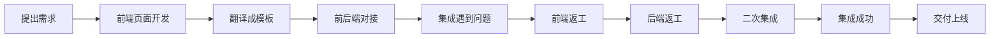
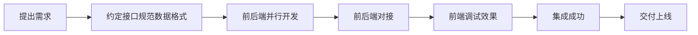

## 开始

---

使用 PyCharm 创建一个基础 Python 项目

---

```bash
# 下载 django
pip install django
```

---

```bash
# 创建一个 django 项目
django-admin startproject backend
```

---

使用 Idea 的 Mark Directory as Sources Root 将刚刚创建的 backend 文件夹标记，
即源代码目录，**backend 下只能存放源代码，像 docs、logs、data 等目录只能与其同级**。

---

打开 Idea 设置，搜索 Django，勾选 Enable Django Support，设置 Django project root 和 Settings

---

在 backend 目录下创建一个 apps 目录，用于存放 app，注意，创建出来的 apps.py 中的 XxxConfig 的 name 属性
似乎需要加个 apps. 前缀

```bash
# 创建 app
cd ./backend/apps
django-admin startapp ninjaapi
```

---

在 backend 同级位置创建一个 requirements.txt 文件，用于存放项目依赖。
推荐 requirments.txt 中不要有任何注释，因为 pip install -r requirements.txt 时，可能解析出错。
目前不强制要求指定库版本。

---

注意，下载的第三方库，有些是需要修改 settings.py 文件的，如 INSTALLED_APPS 等，请务必注意。
故，本项目的 settings.py 文件是非常重要的文件，对未来再开发项目有着重要意义。

---

配置完第三方库的 INSTALLED_APPS 等后，需要执行 python manage.py migrate 数据库迁移命令。

---

创建用户的命令：

```bash
python manage.py createsuperuser --username admin --email admin@example.com
```

---

项目结构：

```txt
python_web_development/
├── backend/
│   ├── apps/
│   ├── backend/
│   ├── static/
│   ├── templates/
│   └── manage.py
│
├── docs/
├── logs/
├── data/
│
├── .env
├── .gitignore
├── requirements.txt
├── note.md
└── readme.md
```

---

### Django

```bash
# 查看可使用的命令
python ./backend/manager.py help
# 进入 django shell
python ./backend/manager.py shell
```

---

from django.core import serializers 中的 serializers 不必使用了，
用 drf 的 serializers.ModelSerializer

---

### Django REST framework

练习经典的组合：Django + Django REST framework

#### ViewSet ModelViewSet DefaultRouter

ModelViewSet 才能利用 DefaultRouter 的自动文档生成/获得 DRF 的浏览接口支持，ViewSet 不行

---

### Django Ninja

主要目的是练习异步编程 + 只提供 API 接口，不涉及前端

### uvicorn

```bash
uvicorn backend.asgi:application --port 8888
```

上述命令可以启动服务，但是要求执行的时候，需要进入 backend 目录下执行才行！

## 编程规格

此处为本项目严格遵循的个人要求的编程规格说明

1. 每个文件夹的命名不允许使用蛇形，直接将 `_` 删掉，如 `user_info` 改为 `userinfo`
2. 打开 Idea 的设置，Editor -> Inspections -> Proofreading -> Typo，关闭拼写检查，这样可以杜绝强迫症现象，
   虽然可能会出现单词拼写错误，但是写 Lua 模组的经验告诉我，那根本不是个事。
3. 文件夹的命名不需要参考 java 的规范：不要复数，由于 django 项目生成的文件全是复数，所以我要求向其看起，
   每个文件夹的命名能复数的都是复数。
4. 【推荐优先如此】参考 Django 风格，每个字符串都用单引号包裹，形如：'xxx'
5. 注释不要在行末尾，就在行头。
    - 但是有些时候又不太方便，算了，不超过行字符约束的情况下，也可以放在行末尾吧
    - 对于代码整体只算一行的，才能放行末尾。比如：a = [] 不允许放在行末尾
    - 当你认为太长的时候，就应该立刻从行末转移到行首（一般超过 10 个字符就快有这种感觉了）
6. url 的定义都应该形如 a/b/ 而不要 /a/b。
   但是需要注意的是，我目前认为 a/b 反倒最不错，因为 DefaultRouter 拼接 path 的时候，没有判断 /，直接加 / ...
7. 任何对外接口的参数都要指明类型
8. 通用的 utils 函数放在指定位置，app 内部使用的，放在内部的 utils 文件夹下。
   app 内部的 package 中使用的，放在 package 内部的 utils 文件夹下。
9. 【待定】除了官方生成的 `__init__.py`，目前我决定：不要创建 Python Package
10. 目录嵌套层级不要过多，正常情况创建一个 x.py 文件，当文件需要拆分的时候，再创建一个 x 目录
11. 【待定】除了对外公共接口可能除了那几个接口应该一律 `_` 或 `__` 开头外，正常开发，真的懒得考虑那么多，耗费心力，不如思考如何降低颗粒度。
    【实施一下】只能适应，建议规格如此：只要不是外部共享的，一律不允许没有 `_` 或 `__` 前缀！！！（这样也不需要考虑太多）
12. 使用 `【亮点】` 注释标注个人认为算是个亮点的功能，目的是未来检索，用以写简历、面试时使用。
13. Python Package 需要严格遵循非对外接口需要加前缀的原则，但是对于那种入口函数等，我认为没必要吧？def xxx 需要，那 class yyy 呢？
14. 使用 `【知识点】`标注值得关注的，偏向于知识的注释（不要类别太多，只要是有点算知识，就归类为知识点）

### Nicegui 编程
1. 推荐 MVC 架构分层（目前 M: models, V: class View, C: class Controller）
2. class View 中，实例间共享的数据需要探讨一下是否需要在 `def __init__` 中预声明 

### django-ninja 使用规范

#### version 1.0

在 {app_name}/views.py 同级目录下，创建一个 routers.py 文件，用于存放 django-ninja 的路由（纯净一点的话，可以删除 views.py
文件），
该文件要求定义一个 NinjaAPI 类实例，该实例将在 urls.py 中被 import 并使用（import 的目的是加载 routers.py 文件）。

## 使用第三方库

### python-dotenv

### loguru

```python
from loguru import logger

loginfo = "hello world"
logger.info("{}", loginfo)
```

## 总结

**要频繁记录！做过的事情，必须要及时记录下来！**

---

前后端不分离项目开发流程：



前后端分离项目开发流程：



数据接口规范流程：
[click](https://blog.csdn.net/zhangyifeng_1995/article/details/131898576)

---

深入理解什么是 RESTful API：

- [click](https://docs.github.com/zh/rest/about-the-rest-api/comparing-githubs-rest-api-and-graphql-api?apiVersion=2022-11-28)
- [click](https://www.imooc.com/article/304756)

---

ModelViewSet 不如 ViewSet 灵活，属于高度定制类，所以需要将其是为工具，学习如何使用它即可。

---

ipython 可以让 python manager.py shell 的界面更好用

```bash
python ./backend/manager.py shell -i ipython
```

---

Jupyter notebook

已迅速成为数据分析，机器学习的必备工具。因为它可以让数据分析师集中精力向用户解释整个分析过程。

[click](https://www.zhihu.com/tardis/zm/ans/254638807)

Jupyter 这个名字是它要服务的三种语言的缩写：Julia，PYThon 和 R，这个名字与 木星（jupiter） 谐音。

```txt
进入某个目录，执行 jupyter notebook，即可启动一个本地的 Web 服务器，
如果默认 8888 端口被占用，会选择一个新端口。

注意，进入的那个目录会成为当前 jupyter notebook 的根目录，隔离效果很不错！

而且它是一个 web 服务，所以是可以通过 iframe 将 jupyter notebook 显示界面嵌入到网页中的。

指定启动端口号：jupyter notebook --port 8889

参考链接：
[网站搭建8：Django项目中嵌入Jupyter notebook](https://zhuanlan.zhihu.com/p/110214228)
```

---

太强了，ai 编程 + 微调

必须学会充分利用 ai 插件编程！

2025-06-29 的初步使用，体会的好处有：

- 优化代码
- 快速生成代码
- 提供开发思路

---

[important]

- python 实在太灵活，比如刚刚阅读 ui.refreshable 就涉及好几个 `__` 魔术方法，看不懂，但是未来一定要深入的，否则何来精通
  Python？
- *args + **kwargs + 继承 + 魔术方法等，导致我目前很难读懂 python 代码！这是一个需要注意的地方！
- debug 也是可以配合使用的，但是不得不说，使用和学习成熟的第三方库才是有效且有意义的学习方式！

---

后端需要解决端口号的问题，需要套 nginx 吗？还是有其他技术？

---

## 参考资料

1. css 的 inherit、initial、unset、revert：https://cloud.tencent.com/developer/article/2312895
2. https://quasar.dev/vue-components/spinners#qspinner-api
3. 


